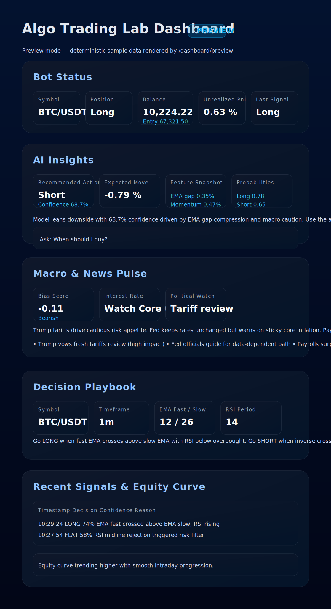

# Algo Trading Lab

Algo Trading Lab; çoklu varlıklar için sinyal üretebilen, risk yönetimi yapan ve ileride hem paper-trading hem de gerçek işlemleri destekleyecek şekilde tasarlanmış modüler bir trading bot iskeletidir.

## Özellikler
- Python tabanlı bot döngüsü (EMA crossover + RSI onayı) ve JSON tabanlı state saklama.
- Paper trading modu için sentetik veri üreticisi; ileride ccxt ile gerçek borsa entegrasyonuna hazır.
- FastAPI servisi aracılığıyla `/status`, `/signals`, `/equity`, `/strategy` endpoint’leri ve dahili web dashboard'u.
- Yapay zekâ katmanı için `/ai/prediction` (tahmin) ve `/ai/question` (soru-cevap) endpoint’leri ile dashboard üzerindeki AI Insights bölümü.
- Trump gibi politik aktörlerin kararları ve Fed faiz beklentileri gibi makro başlıkları skorlayan makro motoru; `/macro/insights` endpoint’i ve dashboard üzerindeki **Macro & News Pulse** paneli ile son katalizörleri takip eder.
- Çoklu piyasa portföyü için `/portfolio/playbook` endpoint’i ve dashboard’daki **Multi-Market Portfolio Playbook** paneli; BTC, ETH, altın, gümüş ve petrol gibi emtia/kripto başlıklarını; AAPL, MSFT gibi mega-cap hisseleri kısa/orta/uzun vadeli strateji dökümleriyle ve makro özetleriyle birlikte sunar.
- EMA/RSI aralığı, RSI eşikleri ve makro bias'ı birlikte değerlendiren yeni **strateji arama (research) aracı** ile grid-search denemelerini kod yazmadan başlatabilirsiniz.
- Docker + docker-compose ile 7/24 çalışacak şekilde konteynerleştirme.
- İlerleyen fazlarda self-supervised learning modelinin entegre edilebilmesi için ayrıştırılmış strateji ve state katmanı.

## Dizin Yapısı
```
algo_trading_lab/
├── bot/
│   ├── ai.py           # Heuristik AI tahmincisi ve soru-cevap motoru
│   ├── bot.py          # Ana loop ve risk yönetimi
│   ├── exchange.py     # ccxt wrapper + paper-exchange mock
│   ├── research.py     # EMA/RSI parametre araması ve makro farkındalıkla grid search
│   ├── state.py        # JSON tabanlı state/signals/equity saklama
│   └── strategy.py     # EMA/RSI stratejisi ve pozisyon boyutu hesapları
├── api/
│   ├── api.py          # FastAPI uygulaması
│   └── schemas.py      # Pydantic response şemaları
├── data/               # State dosyaları, örnek OHLCV ve makro event setleri
├── Dockerfile
├── docker-compose.yml
├── requirements.txt
├── .env.example
└── README.md
```

## Başlangıç
1. Ortam değişkenlerini düzenleyin:
   ```bash
   cp .env.example .env
   # .env içindeki değerleri ihtiyacınıza göre güncelleyin
   ```
   - Binance Futures veya Spot testnet anahtarlarınız varsa `.env` içine `BINANCE_TESTNET_API_KEY`, `BINANCE_TESTNET_SECRET` ve `BINANCE_TESTNET_USE_FUTURES=true/false` gibi alanları ekleyin. Ayrıntılı entegrasyon adımları için [docs/binance_testnet_guide.md](docs/binance_testnet_guide.md) dosyasına bakabilirsiniz.
2. Konteynerleri ayağa kaldırın:
   ```bash
   docker-compose up --build
   ```
3. FastAPI arayüzü varsayılan olarak `http://localhost:8000/docs` adresinde çalışır.
4. Yönetim dashboard'una `http://localhost:8000/dashboard` adresinden erişebilirsiniz.
   - Bot henüz çalışmıyorsa bile `/dashboard/preview` (veya `?demo=1` parametresi) ile canlı önizlemeyi görebilirsiniz.
   - Dashboard üzerindeki **AI Insights** bölümü, `/ai/prediction` ve `/ai/question` endpoint'lerinden gelen verilerle modelin önerdiği aksiyonu, olasılık dağılımını ve açıklamasını gösterir.
   - **Decision Playbook** bölümü, botun ne zaman LONG/SHORT olacağını ve risk yönetimini nasıl yaptığını `/strategy` endpoint'inden aldığı verilere göre özetler.

## Dashboard nasıl görünüyor?



Dashboard, tek sayfalık bir arayüz içinde aşağıdaki bloklarla organize edilmiştir:
- **Üst durum şeridi:** Seçili sembol, pozisyon, giriş fiyatı, gerçekleşmemiş PnL ve bot çalışma modunu gösteren renk kodlu kartlar.
- **Signal Stream:** Sağ tarafta son sinyaller, emir özetleri ve AI tahminlerine ait kısa açıklamalar kronolojik olarak akar.
- **Equity & Risk:** Orta bölümde equity eğrisi, günlük PnL şeridi ve risk parametreleri yan yana yer alır. Preview modunda örnek veri, canlı modda state dosyasındaki gerçek değerler gösterilir.
- **AI Insights:** AI aksiyonu, olasılıklar, açıklayıcı özellikler (EMA açığı, momentum vb.) ve kısa anlatım kutucuğu.
- **Decision Playbook:** EMA/RSI eşiklerini, stop-loss/take-profit örneklerini ve pozisyon boyutu formülünü, canlı strateji konfigürasyonuna göre açıklar.
- **Macro & News Pulse:** Trump/Fed gibi katalizörleri, makro bias skorunu, faiz görünümünü ve siyasi risk özetlerini listeler.
- **Multi-Market Portfolio Playbook:** BTC, ETH, XAU, XAG, petrol ve mega-cap hisseler için kısa/orta/uzun vadeli performans özetlerini, makro bias skorlarını ve strateji notlarını yan yana gösterir.
- **Assistant formu:** Dashboard alt kısmındaki form ile `/ai/question` endpoint’ine soru gönderebilir, cevapları gerçek zamanlı görebilirsiniz; preview modunda örnek sorular hazır gelir.

`/dashboard/preview` rotası bu bileşenlerin tamamını örnek veriyle render eder; bu sayede botu başlatmadan arayüzü inceleyebilir ve tasarımı özelleştirebilirsiniz. Daha ayrıntılı bir bölümlendirme ve hem SVG hem ASCII yerleşim krokisi için [docs/ui_walkthrough.md](docs/ui_walkthrough.md) dosyasına göz atabilirsiniz.

## Strateji arama aracını çalıştırma

Trump/Fed haberlerine duyarlı parametre setleri denemek için `bot/research.py` içindeki araçla brute-force grid search yapabilirsiniz. Varsayılan olarak sentetik `PaperExchangeClient` verisi üretir; elinizde CSV varsa onu da kullanabilirsiniz.

```bash
# Sentetik veri ve varsayılan parametre aralığı ile 500 mumluk test
python -m bot.research --symbol BTC/USDT --timeframe 1m --lookback 500

# Kendi CSV dosyanız (timestamp,open,high,low,close,volume) ve makro event'leriyle
python -m bot.research \
  --csv data/sample_ohlcv.csv \
  --macro-events data/macro_events.sample.json \
  --ema-fast 5,8,12,16 \
  --ema-slow 21,26,32,40 \
  --rsi-overbought 60,65,70 \
  --rsi-oversold 20,25,30
```

Komut tamamlandığında Sharpe, toplam getiri, kazanma oranı ve makro bias'ı birlikte skorlayan en iyi kombinasyonlar listelenir. Çıktıdaki `EMA`, `RSI` değerlerini `.env` veya dashboard’un **Decision Playbook** paneline taşıyarak canlı bota uygulayabilirsiniz. Örnek CSV için `data/sample_ohlcv.csv` dosyasına bakabilirsiniz.

## Neleri geliştirebilirim?
Aşağıdaki alanlar ilk etapta kolayca genişletilebilir:
1. **Görsel tema ve marka kimliği:** `api/dashboard.html` içinde Tailwind-esintili yardımcı sınıflar bulunuyor; kendi renk paletinizi eklemek için `<style>` bloklarındaki CSS değiştirilebilir veya harici bir CSS dosyası eklenebilir.
2. **Grafik kütüphaneleri:** Şu an lightweight SVG grafikleri kullanılıyor. Highcharts, Plotly veya TradingView widget’ını ekleyerek daha detaylı grafikler sunabilirsiniz.
3. **Çoklu enstrüman desteği:** Dashboard’daki sembol seçiciyi genişleterek aynı anda birden fazla varlık için sinyal/equity görüntüleme imkânı ekleyebilirsiniz.
4. **Bildirim ve uyarılar:** WebSocket/Server-Sent Events kanalıyla yeni sinyaller veya kritik makro olaylar için tarayıcı bildirimleri göndermek mümkün.
5. **Kullanıcı yönetimi:** FastAPI tarafında auth katmanı ekleyip dashboard’u parola korumalı hale getirebilirsiniz.

## Uzun Vadeli Vizyon ve Yapay Zekâ Yol Haritası

Strateji arama, makro farkındalık, yerel SSL eğitim süreçleri ve yüksek frekanslı yürütme için daha ayrıntılı öneriler arıyorsanız [docs/product_vision_and_ai_roadmap.md](docs/product_vision_and_ai_roadmap.md) dosyasına göz atabilirsiniz. Bu belge; çoklu piyasa kapsamı, haber akışından gelen katalizörlerin değerlendirilmesi, self-supervised öğrenme hattı, reinforcement tabanlı politika optimizasyonu ve operatör arayüzü geliştirmeleri gibi ileri seviye fikirleri tek çatı altında toplar.

## High Frequency Trading (HFT) yol haritası
HFT’ye yaklaşırken aşağıdaki teknik geliştirmeler önemlidir:
1. **Düşük gecikmeli veri akışı:** REST çağrıları yerine Binance WebSocket (ccxt.pro veya python-binance) kullanarak milisaniye seviyesinde fiyat güncellemeleri alın.
2. **Asenkron bot döngüsü:** `bot/bot.py` içinde veri alma, sinyal hesaplama ve emir gönderme adımlarını `asyncio` tabanlı hale getirip aynı anda birden fazla varlık için concurrency sağlayın.
3. **Order book izleme:** Yalnızca OHLCV yerine seviye-2 order book verilerini okuyup mikro yapı sinyalleri (spread, imbalance) üretin.
4. **Risk guardrail’leri:** HFT’de hatalar hızlı büyür; latency, başarısız emir sayısı veya art arda zarar limitleri için otomatik circuit breaker’lar ekleyin.
5. **Performans ölçümü:** Prometheus metrikleriyle ortalama latency, fill oranı, kayma (slippage) ve PnL dağılımını takip edin; Grafana veya özel dashboard’a gerçek zamanlı grafikler ekleyin.
6. **Backtest & simülasyon:** vectorbt/backtrader ile saniyelik/dakikalık veri üzerinde HFT stratejisi senaryolarını simüle edip gerçek ortamla kıyaslayın.

Bu yol haritasındaki adımlar, mevcut mimariye kademeli olarak entegre edilerek UI’nın sunduğu içgörüleri milisaniye ölçekli karar destek sistemine dönüştürmenize yardımcı olur.

## AI Destekli Tahmin ve Soru-Cevap
- **AI Prediction (`GET /ai/prediction`)**: Son loop’taki yapay zekâ değerlendirmesini döndürür. Yanıt, önerilen aksiyon (`LONG`/`SHORT`/`FLAT`), güven skoru, uzun/kısa/düz olasılıkları, beklenen hareket yüzdesi ve kullanılan ana özelliklerin hızlı özetini içerir.
- **AI Question (`POST /ai/question`)**: JSON gövdesinde `{ "question": "When should I buy?" }` benzeri bir istekle stratejiye dair sorular sorabilirsiniz. Motor, güncel state ve AI tahminini kullanarak yanıt verir.
- Dashboard’daki formu kullanarak aynı soru-cevap deneyimini tarayıcıdan da test edebilirsiniz; preview modunda örnek yanıtlar simüle edilir.
- Sorularınıza `macro`, `Trump`, `Fed`, `rates` gibi anahtar kelimeler eklerseniz AI motoru makro modülden gelen öngörüleri de yanıtına dahil eder.

## Çoklu Piyasa Portföy Playbook'u
- **Endpoint (`GET /portfolio/playbook`)**: Botun kaydettiği state dosyasından BTC, ETH, XAU, XAG, USOIL gibi emtia/kripto sembollerini ve AAPL, MSFT, AMZN, GOOG, TSLA, NVDA gibi mega-cap hisseleri toplar. Her varlık için kısa (1m), orta (15m) ve uzun (1h) ufuklarda beklenen getiri, Sharpe, kazanma oranı, işlem sayısı ve makro bias değerleri hesaplanır.
- **Başlangıç bakiyesi senaryosu**: İstek gövdesi gerektirmez; bot konfigürasyonundaki `STARTING_BALANCE` değeri referans alınır ve her ufukta başlangıç/son bakiye bilgisi döner.
- **Makro anlatılar**: Trump’ın tarifeleri veya Fed faiz patikası gibi olaylardan gelen makro özetler ve driver listeleri aynı yanıt içinde yer alır; dashboard üzerindeki kartlarda kısa notlar, faiz/politika uyarıları ve “en iyi / en zorlanan horizon” başlıkları görünür.
- **Uzun/kısa vadeli fikirler**: Dashboard’daki **Multi-Market Portfolio Playbook** paneli, bu endpoint’ten gelen JSON’u kullanarak hangi varlığın hangi ufukta öne çıktığını, hangisinin baskılandığını ve makro ortamın risk iştahını nasıl etkilediğini görsel olarak sunar. Preview rotası da aynı paneli örnek verilerle render eder.

## Makro & Haber Farkındalığı
- Bot döngüsü her turda `bot/macro.py` içindeki `MacroSentimentEngine` ile makro/politik olay listesini değerlendirir. Varsayılan olarak Trump’ın tarifeleri ve Fed toplantı rehberliği gibi örnek olaylar gelir; kendi olaylarınızı `data/macro_events.json` benzeri bir dosyayla genişletebilirsiniz.
- Özel olaylar eklemek için JSON listesi kullanın. Örnek yapı `data/macro_events.sample.json` içinde yer alır:
  ```json
  [
    {
      "title": "Trump announces new tariff schedule",
      "category": "politics",
      "sentiment": "bearish",
      "impact": "high",
      "actor": "Donald Trump",
      "summary": "Tariff threats raise volatility across risk assets.",
      "assets": { "BTC/USDT": -0.2, "ETH/USDT": -0.15 }
    },
    {
      "title": "FOMC statement",
      "category": "central_bank",
      "sentiment": "dovish",
      "impact": "medium",
      "interest_rate_expectation": "Fed signals a cautious path with one cut pencilled in for Q4."
    }
  ]
  ```
- Dosyayı botun eriştiği `DATA_DIR` altında `macro_events.json` adıyla saklayın ve `.env` içinde `MACRO_EVENTS_PATH=data/macro_events.json` şeklinde işaret edin. `MACRO_REFRESH_SECONDS` ile yükleme aralığını (varsayılan 300 sn) değiştirebilirsiniz.
- `/macro/insights` endpoint’i ve dashboard’daki **Macro & News Pulse** paneli; özet makro bias skorunu, güven seviyesini, faiz beklentilerini ve son katalizör listesini JSON veya görsel olarak sunar. Bu sinyaller AI tahminine ağırlık olarak eklenir, böylece haber akışı LONG/SHORT kararlarını güçlendirebilir veya zayıflatabilir.

## Lokal Geliştirme
```bash
python -m venv .venv
source .venv/bin/activate
pip install -r requirements.txt
export $(grep -v '^#' .env | xargs)  # veya dotenv kullanın
python -m bot.bot  # bot döngüsünü başlatır
uvicorn api.api:app --reload
```

## Örnek State Çıktısı
```json
{
  "timestamp": "2025-10-28T16:32:00Z",
  "symbol": "BTC/USDT",
  "position": "LONG",
  "entry_price": 67321.5,
  "unrealized_pnl_pct": 0.42,
  "last_signal": "LONG",
  "confidence": 0.66,
  "rsi": 54.2,
  "ema_fast": 67310.1,
  "ema_slow": 67190.7,
  "risk_per_trade_pct": 0.5,
  "ai_action": "LONG",
  "ai_confidence": 0.72,
  "ai_probability_long": 0.72,
  "ai_probability_short": 0.18,
  "ai_probability_flat": 0.1,
  "ai_expected_move_pct": 0.64,
  "ai_summary": "Model leans upside with 72.0% confidence driven by EMA spread 0.48% and momentum 0.35%. Expected move: 0.64%",
  "ai_features": {
    "ema_gap_pct": 0.48,
    "momentum_pct": 0.35,
    "rsi_distance_from_mid": 8.5,
    "volatility_pct": 0.62
  },
  "macro_bias": -0.18,
  "macro_confidence": 0.58,
  "macro_summary": "Macro bias is bearish (-0.18) based on 3 tracked catalysts. Fed watch: Fed likely to keep rates unchanged but watch core inflation prints. Political risk: Donald Trump: Potential tariff escalation keeps risk assets cautious.",
  "macro_drivers": [
    "Trump vows fresh tariffs review (bearish, high impact)",
    "US payrolls surprise to upside (hawkish, high impact)"
  ],
  "macro_interest_rate_outlook": "Fed likely to keep rates unchanged but watch core inflation prints.",
  "macro_political_risk": "Donald Trump: Potential tariff escalation keeps risk assets cautious.",
  "macro_events": [
    {
      "title": "Trump vows fresh tariffs review",
      "category": "politics",
      "sentiment": "bearish",
      "impact": "high",
      "actor": "Donald Trump"
    },
    {
      "title": "Fed officials guide for data-dependent path",
      "category": "central_bank",
      "impact": "medium",
      "interest_rate_expectation": "Fed likely to keep rates unchanged but watch core inflation prints."
    }
  ]
}
```

## Notlar
- `requirements.txt` dosyası temel bağımlılıkları içerir. SSL/ML entegrasyonu için PyTorch ve PyTorch Lightning ek olarak kurulmalıdır (platforma göre whl dosyaları değişir).
- Paper mode dışına çıkarken `.env` dosyasındaki `PAPER_MODE=false` ve API anahtarları alanlarını güncelleyin.
- Çoklu enstrüman desteği için `docker-compose` içerisine aynı imajdan türetilmiş yeni servisler eklenebilir veya bot loop’u parametre alacak şekilde genişletilebilir.


## Backend ve Frontend Açıkları
Proje hangi alanlarda henüz eksik diye hızlıca bakmak için [`docs/backend_frontend_gaps.md`](docs/backend_frontend_gaps.md) dosyasına göz atın. Bu doküman hem sunucu tarafında (borsa entegrasyonu, risk yönetimi, dağıtım) hem de arayüz tarafında (component mimarisi, gerçek zamanlı veri akışı, erişilebilirlik) tamamlanması gereken somut maddeleri kontrol listesi şeklinde sunar.
